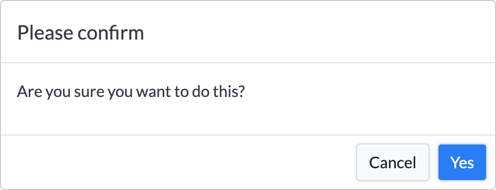

Boodal
=============

Boodal is an easy to use modal library for Bootstrap 4 for simple prompts.

## Quick Start

```html
<head>    
    <script src="/path/to/jquery.js"></script>
    <script src="/path/to/bootstrap.min.js"></script>
    <script src="/path/to/boodal.min.js"></script>
</head>
<body>
    
    <script>
        boodal.alert({
            'title': 'Unexpected Error', // required
            'body': 'There has been an unexpected error', // required
            'ok.callback': function(){  // optional, a callback on 'ok' triggered
                console.log('The alert was closed.');
            }
        });
    </script>
</body>
```

## Prompt options

All boodal modals are required to have the `title` and `body` keys provided.

All input/textarea/confirm/select/radio/checkbox prompts must also contain an `ok.callback` function which will pass back the value, or (or array of values for checkboxes) selected. If no value is provided, the value is always `null`.

Inputs or textareas can contain the `maxLength` key to show a helpful character counter.

## Minifying

Download `yuicompressor-2.4.8.jar` and run:

```
java -jar yuicompressor-2.4.8.jar --type js public/assets/js/boodal/boodal.js > public/assets/js/boodal/boodal.min.js
```


## Available Prompts

### Basic `alert`

```javascript
boodal.alert({
    'title': 'Unexpected Error', // required
    'body': 'There has been an unexpected error' // required, string or string of html
});
```


### Basic `confirm`

```javascript
boodal.alert({
    'confirm': 'Please confirm', // required
    'body': 'Are you sure you want to do this?', // required, string or string of html
    'ok.callback': function() { // required, a callback on confirming the modal.
        console.log('Confirmed');
    }
});
```



### Basic `text`

```javascript
boodal.text({
    'title': 'Change name', // required, the modal title
    'body': 'Enter your name below:', // required, string or string of html
    'ok.callback': function(result){ // required, a callback on 'ok' triggered, passes in the value or null
        console.log(result);
    }
});
```


### Basic `email`

```javascript
boodal.email({
    'title': 'Change email', // required, the modal title
    'body': 'Enter your email address below:', // required, string or string of html
    'ok.callback': function (result) { // required, a callback on 'ok' triggered, passes in the value or null
        console.log(result);
    }
});
```


### Basic `number`

```javascript
boodal.number({
    'title': 'Change age', // required, the modal title
    'body': 'Enter your age below:', // required, string or string of html
    'ok.callback': function(result){ // required, a callback on 'ok' triggered, passes in the value or null
        console.log(result);
    }
});
```


### Basic `select`

```javascript
boodal.select({
    'title': 'Change sport', // required, the modal title
    'body': 'Select your favourite sport below:', // required, string or string of html
    'ok.callback': function(result){ // required, a callback on 'ok' triggered, passes in the selected value or null
        console.log(result);
    },
    'options': ['Football', 'Rugby'] // required, the select options, can also be a key->value object
});
```


### Basic `checkbox`

```javascript
boodal.checkbox({
    'title': 'Select sports', // required, the modal title
    'body': 'Select your preferred sports below:', // required, string or string of html
    'ok.callback': function(results) { // required, a callback on 'ok' triggered, passes in the checked values or null
        console.log(results);
    },
    'options': ['Rugby', 'Football'] // required, the checkbox options, can also be a key->value object
});
```


### Basic `radio`

```javascript
boodal.radio({
    'title': 'Select sport', // required, the modal title
    'body': 'Select your preferred sport below:', // required, string or string of html
    'ok.callback': function(result) { // required, a callback on 'ok' triggered, passes in the selected value or null
        console.log(result);
    },
    'options': ['Rugby', 'Football'] // required, the radio optionas, can also be a key->value object
});
```


#### `alert`

To generate a simple alert box:

```javascript
boodal.alert(
    {
        /* Required values */
        'title': 'Unexpected Error', // required, the modal title
        'body': 'There has been an unexpected error', // required, string or string of html

        /* Optional values */
        'cancel': 'Close', // optional, default 'Cancel'
        'ok': 'Close', // optional, default 'OK'
        'ok.class': 'btn-danger', // optional, default 'btn-secondary'
        'ok.callback': function(){ // required, a callback on 'ok' triggered
            console.log('Dismissed');
        },
        'modal.backdrop': 'static', // optional, boolean or 'static'. default 'static'
        'modal.keyboard': false, // optional, default false
        'modal.focus': true // optional, default true
    }
);
```

#### `confirm`

To generate a simple confirmation box:

```javascript
boodal.confirm(
    {
        /* Required values */
        'title': 'Please confirm', // required, the modal title
        'body': 'Are you sure you want to do this?', // required, string or string of html
        'ok.callback': function(){ // required, a callback on 'ok' triggered
            console.log('Dismissed');
        },

        /* Optional values */
        'ok': 'Yes', // optional, default 'Yes'
        'ok.class': 'btn-primary', // optional, class name for the OK button, default 'btn-primary'
        'cancel': 'Cancel',
        'cancel.callback': function(){}, // optional, a callback when cancel is triggered.
        'cancel.class': 'btn-light', // optional, class name for the cancel button, default 'btn-light'
        'modal.backdrop': 'static', // optional, boolean or 'static'. default 'static'
        'modal.focus': true, // optional, default true
    }
);
```

#### `text`

To generate a text entry box:

```javascript
boodal.text(
    {
        /* Required values */
        'title': 'Change name', // required, the modal title
        'body': 'Enter your name below:', // required, string or string of html
        'ok.callback': function(result){ // required, a callback on 'ok' triggered, passes in the value or null
            console.log(result);
        },

        /* Optional values */
        'val': 'Foo Bar', // optional, the default value for the input box
        'placeholder': 'Enter your name...', // optional, the placeholder for the input box
        'attrs': { // optional, default {}
            'class': 'first-class second-class', // list of class names
            'id': 'my-id' // the input `id` value.
        },
        'cancel': 'Close', // optional, default 'Cancel'
        'ok': 'Save', // optional, default 'OK'
        'ok.class': 'btn-success', // optional, default 'btn-secondary'
        'cancel.callback': function(){ // optional, default function(){}
            console.log('cancelled');
        },
        'modal.backdrop': 'static', // optional, boolean or 'static'. default 'static'
        'modal.focus': true, // optional, default true
        'modal.close': true // optional, default true, whether to show the close icon and allow closing.
    }
);
```

#### `email`

To generate an email address entry box:

```javascript
boodal.email(
    {
        /* Required values */
        'title': 'Change email', // required, the modal title
        'body': 'Enter your email address below:', // required, string or string of html
        'ok.callback': function(result){ // required, a callback on 'ok' triggered, passes in the value or null
            console.log(result);
        },

        /* Optional values */
        'val': 'foo@bar.com', // optional, the default value for the input box
        'placeholder': 'Enter your email...', // optional, the placeholder for the input box
        'attrs': { // optional, default {}
            'class': 'first-class second-class', // list of class names
            'id': 'my-id' // the input `id` value.
        },
        'cancel': 'Close', // optional, default 'Cancel'
        'ok': 'Save', // optional, default 'OK'
        'ok.class': 'btn-success', // optional, default 'btn-secondary'
        'cancel.callback': function(){ // optional, default function(){}
            console.log('cancelled');
        },
        'modal.backdrop': 'static', // optional, boolean or 'static'. default 'static'
        'modal.focus': true, // optional, default true
        'modal.close': true // optional, default true, whether to show the close icon and allow closing.
    }
);
```

#### `number`

To generate a number entry box (not that anyone actually wants to use `type="number"`):

```javascript
boodal.number(
    {
        /* Required values */
        'title': 'Change age', // required, the modal title
        'body': 'Enter your age below:', // required, string or string of html
        'ok.callback': function(result){ // required, a callback on 'ok' triggered, passes in the value or null
            console.log(result);
        },

        /* Optional values */
        'val': '12', // optional, the default value for the input box
        'placeholder': 'Enter your age...', // optional, the placeholder for the input box
        'attrs': { // optional, default {}
            'class': 'first-class second-class', // list of class names
            'id': 'my-id' // the input `id` value.
        },
        'cancel': 'Close', // optional, default 'Cancel'
        'ok': 'Save', // optional, default 'OK'
        'ok.class': 'btn-success', // optional, default 'btn-secondary'
        'cancel.callback': function(){ // optional, default function(){}
            console.log('cancelled');
        },
        'modal.backdrop': 'static', // optional, boolean or 'static'. default 'static'
        'modal.focus': true, // optional, default true
        'modal.close': true // optional, default true, whether to show the close icon and allow closing.
    }
);
```

#### `select`

To generate a select box:

```javascript
boodal.select(
    {
        /* Required values */
        'title': 'Change age', // required, the modal title
        'body': 'Select your age below:', // required, string or string of html
        'ok.callback': function(result){ // required, a callback on 'ok' triggered, passes in the selected value or null
            console.log(result);
        },
        'options': ['Football', 'Rugby'], // required, accepts a key->value object, or array

        /* Optional values */
        'val': 'Rugby', // optional, the default selected value
        'placeholder': 'Please select...', // optional, the placeholder for the select box (a disabled option)
        'attrs': { // optional, default {}
            'class': 'first-class second-class', // list of class names
            'id': 'my-id' // the select `id` value.
        },
        'cancel': 'Close', // optional, default 'Cancel'
        'ok': 'Save', // optional, default 'OK'
        'ok.class': 'btn-success', // optional, default 'btn-secondary'
        'cancel.callback': function(){ // optional, default function(){}
            console.log('cancelled');
        },
        'modal.backdrop': 'static', // optional, boolean or 'static'. default 'static'
        'modal.focus': true, // optional, default true
        'modal.close': true // optional, default true, whether to show the close icon and allow closing.
    }
);
```

#### `checkbox`

To generate a number of checkboxes:

```javascript
boodal.checkbox(
    {
        /* Required values */
        'title': 'Select sports', // required, the modal title
        'body': 'Select your preferred sports below:', // required, string or string of html
        'options': ['Rugby', 'Football'], // required, accepts a key->value object, or array
        'ok.callback': function(results){ // required, a callback on 'ok' triggered, passes in the checked values or null
            console.log(results);
        },

        /* Optional values */
        'vals': ['Football'], // optional, the default checked values
        'attrs': { // optional, default {}
            'class': 'first-class second-class' // list of class names
        },
        'ok': 'Save', // optional, default 'OK'
        'ok.class': 'btn-success', // optional, default 'btn-secondary'
        'cancel.callback': function(){ // optional, default function(){}
            console.log('cancelled');
        },
        'modal.backdrop': 'static', // optional, boolean or 'static'. default 'static'
        'modal.focus': true, // optional, default true
        'modal.close': true // optional, default true, whether to show the close icon and allow closing.
    }
);
```

#### `radio`

To generate a number of radio boxes:

```javascript
boodal.radio(
    {
        /* Required values */
        'title': 'Select sport', // required, the modal title
        'body': 'Select your favourite sport:', // required, string or string of html
        'options': ['Rugby', 'Football'], // required, accepts a key->value object, or array
        'ok.callback': function(result){ // required, a callback on 'ok' triggered, passes in the selected value or null
            console.log(result);
        },

        /* Optional values */
        'val': 'Football', // optional, the default selected value
        'attrs': { // optional, default {}
            'class': 'first-class second-class' // list of class names
        },
        'ok': 'Save', // optional, default 'OK'
        'ok.class': 'btn-success', // optional, default 'btn-secondary'
        'cancel.callback': function(){ // optional, default function(){}
            console.log('cancelled');
        },
        'modal.backdrop': 'static', // optional, boolean or 'static'. default 'static'
        'modal.focus': true, // optional, default true
        'modal.close': true // optional, default true, whether to show the close icon and allow closing.
    }
);
```
